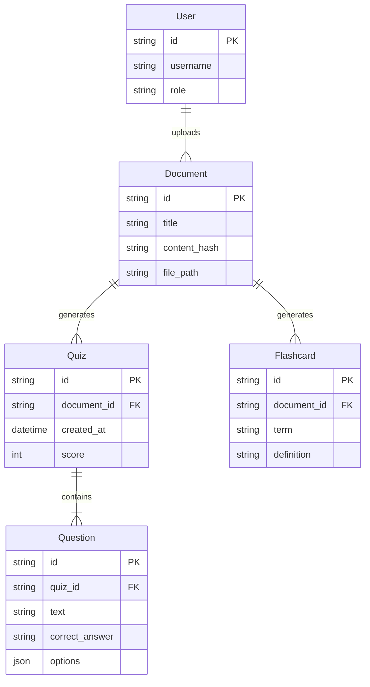

```mermaid
erDiagram
    User ||--|{ Document : uploads
    User {
        string id PK
        string username
        string role
    }

    Document ||--|{ Quiz : generates
    Document ||--|{ Flashcard : generates
    Document {
        string id PK
        string title
        string content_hash
        string file_path
    }

    Quiz ||--|{ Question : contains
    Quiz {
        string id PK
        string document_id FK
        datetime created_at
        int score
    }

    Question {
        string id PK
        string quiz_id FK
        string text
        string correct_answer
        json options
    }

    Flashcard {
        string id PK
        string document_id FK
        string term
        string definition
    }
```
