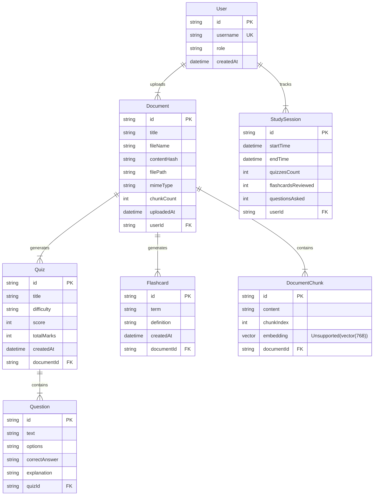

```mermaid
erDiagram
    User ||--|{ Document : uploads
    User ||--|{ StudySession : tracks
    User {
        string id PK
        string username UK
        string role
        datetime createdAt
    }

    Document ||--|{ Quiz : generates
    Document ||--|{ Flashcard : generates
    Document ||--|{ DocumentChunk : contains
    Document {
        string id PK
        string title
        string fileName
        string contentHash
        string filePath
        string mimeType
        int chunkCount
        datetime uploadedAt
        string userId FK
    }

    DocumentChunk {
        string id PK
        string content
        int chunkIndex
        vector embedding "Unsupported(vector(768))"
        string documentId FK
    }

    Quiz ||--|{ Question : contains
    Quiz {
        string id PK
        string title
        string difficulty
        int score
        int totalMarks
        datetime createdAt
        string documentId FK
    }

    Question {
        string id PK
        string text
        string options
        string correctAnswer
        string explanation
        string quizId FK
    }

    Flashcard {
        string id PK
        string term
        string definition
        datetime createdAt
        string documentId FK
    }

    StudySession {
        string id PK
        datetime startTime
        datetime endTime
        int quizzesCount
        int flashcardsReviewed
        int questionsAsked
        string userId FK
    }
```
