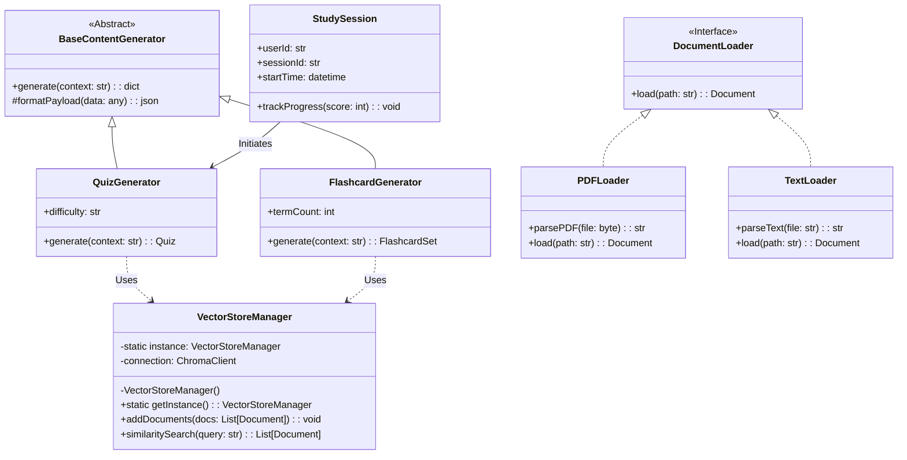

```mermaid
classDiagram
    %% Core Abstraction
    class BaseContentGenerator {
        <<Abstract>>
        +generate(context: str): dict
        #formatPayload(data: any): json
    }

    %% Concrete Implementations
    class QuizGenerator {
        +difficulty: str
        +generate(context: str): Quiz
    }

    class FlashcardGenerator {
        +termCount: int
        +generate(context: str): FlashcardSet
    }

    BaseContentGenerator <|-- QuizGenerator
    BaseContentGenerator <|-- FlashcardGenerator

    %% Document Parsing (Interface & Polymorphism)
    class DocumentLoader {
        <<Interface>>
        +load(path: str): Document
    }

    class PDFLoader {
        +parsePDF(file: byte): str
        +load(path: str): Document
    }

    class TextLoader {
        +parseText(file: str): str
        +load(path: str): Document
    }

    DocumentLoader <|.. PDFLoader
    DocumentLoader <|.. TextLoader

    %% Singleton Pattern
    class VectorStoreManager {
        -static instance: VectorStoreManager
        -connection: ChromaClient
        -VectorStoreManager()
        +static getInstance(): VectorStoreManager
        +addDocuments(docs: List[Document]): void
        +similaritySearch(query: str): List[Document]
    }

    %% User Session Tracking
    class StudySession {
        +userId: str
        +sessionId: str
        +startTime: datetime
        +trackProgress(score: int): void
    }

    %% Relationships
    QuizGenerator ..> VectorStoreManager : Uses
    FlashcardGenerator ..> VectorStoreManager : Uses
    StudySession --> QuizGenerator : Initiates
```
