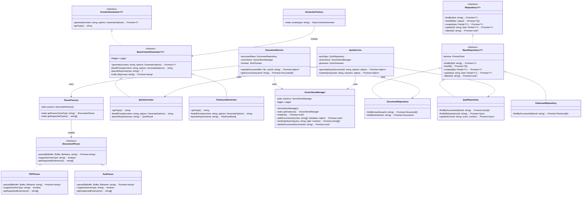

```mermaid
classDiagram
    %% ===== Interfaces =====
    class IDocumentParser {
        <<Interface>>
        +parse(fileBuffer: Buffer, fileName: string): Promise~string~
        +supports(mimeType: string): boolean
        +getSupportedExtensions(): string[]
    }

    class IContentGenerator~T~ {
        <<Interface>>
        +generate(context: string, options: GenerateOptions): Promise~T~
        +getType(): string
    }

    class IRepository~T~ {
        <<Interface>>
        +findById(id: string): Promise~T~
        +findAll(filter: object): Promise~T[]~
        +create(data: Partial~T~): Promise~T~
        +update(id: string, data: Partial~T~): Promise~T~
        +delete(id: string): Promise~void~
    }

    %% ===== Strategy Pattern: Parsers =====
    class PDFParser {
        +parse(fileBuffer: Buffer, fileName: string): Promise~string~
        +supports(mimeType: string): boolean
        +getSupportedExtensions(): string[]
    }

    class TextParser {
        +parse(fileBuffer: Buffer, fileName: string): Promise~string~
        +supports(mimeType: string): boolean
        +getSupportedExtensions(): string[]
    }

    class ParserFactory {
        -static parsers: IDocumentParser[]
        +static getParser(mimeType: string): IDocumentParser
        +static getSupportedTypes(): string[]
    }

    IDocumentParser <|.. PDFParser
    IDocumentParser <|.. TextParser
    ParserFactory --> IDocumentParser : creates

    %% ===== Template Method + Factory: Generators =====
    class BaseContentGenerator~T~ {
        <<Abstract>>
        #logger: Logger
        +generate(context: string, options: GenerateOptions): Promise~T~
        #buildPrompt(context: string, options: GenerateOptions): string*
        #parseResponse(raw: string): T*
        #callLLM(prompt: string): Promise~string~
    }

    class QuizGenerator {
        +getType(): string
        #buildPrompt(context: string, options: GenerateOptions): string
        #parseResponse(raw: string): QuizResult
    }

    class FlashcardGenerator {
        +getType(): string
        #buildPrompt(context: string, options: GenerateOptions): string
        #parseResponse(raw: string): FlashcardItem[]
    }

    class GeneratorFactory {
        +static create(type: string): BaseContentGenerator
    }

    IContentGenerator~T~ <|.. BaseContentGenerator~T~
    BaseContentGenerator <|-- QuizGenerator
    BaseContentGenerator <|-- FlashcardGenerator
    GeneratorFactory --> BaseContentGenerator : creates

    %% ===== Singleton: Vector Store =====
    class VectorStoreManager {
        -static instance: VectorStoreManager
        -logger: Logger
        -VectorStoreManager()
        +static getInstance(): VectorStoreManager
        +initialize(): Promise~void~
        +addDocuments(chunks: string[], metadata: object): Promise~void~
        +similaritySearch(query: string, topK: number): Promise~string[]~
        +deleteDocument(documentId: string): Promise~void~
    }

    %% ===== Repository Pattern =====
    class BaseRepository~T~ {
        <<Abstract>>
        #prisma: PrismaClient
        +findById(id: string): Promise~T~
        +findAll(): Promise~T[]~
        +create(data: Partial~T~): Promise~T~
        +update(id: string, data: Partial~T~): Promise~T~
        +delete(id: string): Promise~void~
    }

    class DocumentRepository {
        +findByUserId(userId: string): Promise~Document[]~
        +findByHash(hash: string): Promise~Document~
    }

    class QuizRepository {
        +findByDocumentId(docId: string): Promise~Quiz[]~
        +findWithQuestions(id: string): Promise~Quiz~
        +updateScore(id: string, score: number): Promise~Quiz~
    }

    class FlashcardRepository {
        +findByDocumentId(docId: string): Promise~Flashcard[]~
    }

    IRepository~T~ <|.. BaseRepository~T~
    BaseRepository <|-- DocumentRepository
    BaseRepository <|-- QuizRepository
    BaseRepository <|-- FlashcardRepository

    %% ===== Services =====
    class DocumentService {
        -documentRepo: DocumentRepository
        -vectorStore: VectorStoreManager
        -chunker: TextChunker
        +uploadDocument(file: File, userId: string): Promise~object~
        +getDocuments(userId: string): Promise~Document[]~
    }

    class QuizService {
        -quizRepo: QuizRepository
        -vectorStore: VectorStoreManager
        -generator: QuizGenerator
        +generateQuiz(documentId: string, options: object): Promise~object~
        +submitQuiz(quizId: string, answers: object): Promise~object~
    }

    %% ===== Relationships =====
    DocumentService --> DocumentRepository : uses
    DocumentService --> VectorStoreManager : uses
    DocumentService --> ParserFactory : uses
    QuizService --> QuizRepository : uses
    QuizService --> VectorStoreManager : uses
    QuizService --> QuizGenerator : uses
```
