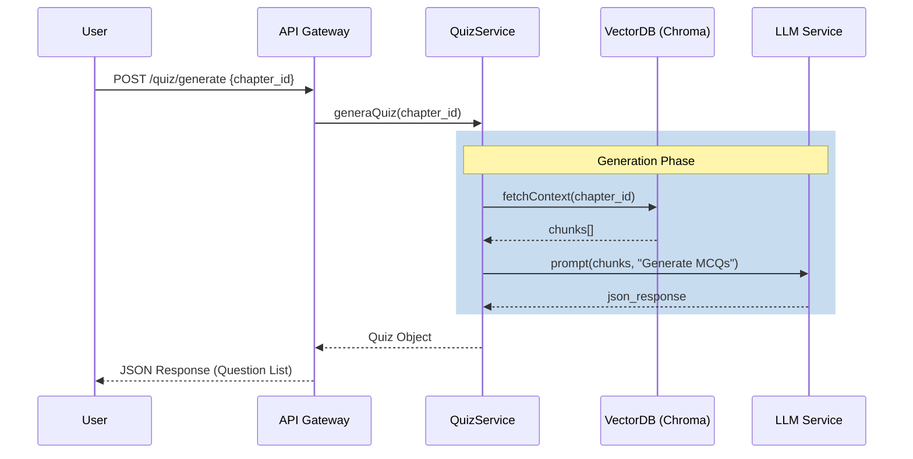

```mermaid
sequenceDiagram
    participant User
    participant API as API Gateway
    participant QS as QuizService
    participant VDB as VectorDB (Chroma)
    participant LLM as LLM Service

    User->>API: POST /quiz/generate {chapter_id}
    API->>QS: generaQuiz(chapter_id)
    rect rgb(200, 220, 240)
        note over QS, LLM: Generation Phase
        QS->>VDB: fetchContext(chapter_id)
        VDB-->>QS: chunks[]
        QS->>LLM: prompt(chunks, "Generate MCQs")
        LLM-->>QS: json_response
    end
    QS-->>API: Quiz Object
    API-->>User: JSON Response (Question List)
```
