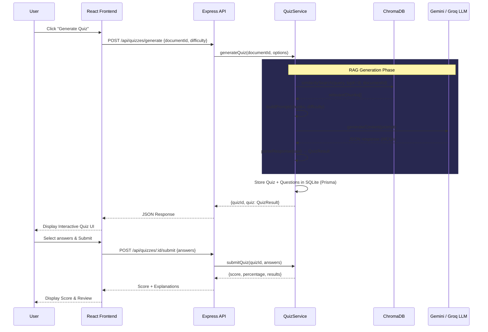

```mermaid
sequenceDiagram
    participant User
    participant React as React Frontend
    participant API as Express API
    participant QS as QuizService
    participant VDB as ChromaDB
    participant LLM as Gemini / Groq LLM

    User->>React: Click "Generate Quiz"
    React->>API: POST /api/quizzes/generate {documentId, difficulty}
    API->>QS: generateQuiz(documentId, options)
    
    rect rgb(40, 40, 80)
        note over QS, LLM: RAG Generation Phase
        QS->>VDB: similaritySearch(query, topK=8, documentId)
        VDB-->>QS: relevantChunks[]
        QS->>QS: buildPrompt(chunks, difficulty)
        QS->>LLM: generateContent(prompt)
        LLM-->>QS: JSON response (MCQs)
        QS->>QS: parseResponse(raw) → QuizResult
    end

    QS->>QS: Store Quiz + Questions in SQLite (Prisma)
    QS-->>API: {quizId, quiz: QuizResult}
    API-->>React: JSON Response
    React-->>User: Display Interactive Quiz UI
    
    User->>React: Select answers & Submit
    React->>API: POST /api/quizzes/:id/submit {answers}
    API->>QS: submitQuiz(quizId, answers)
    QS-->>API: {score, percentage, results}
    API-->>React: Score + Explanations
    React-->>User: Display Score & Review
```
