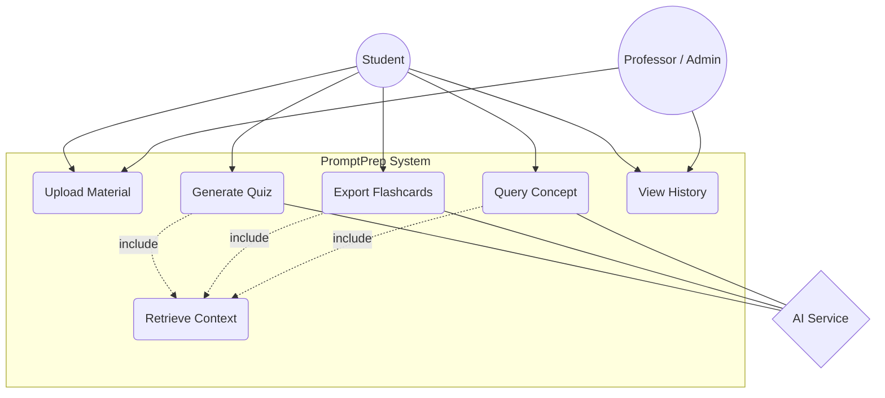

```mermaid
graph TD
    %% Define Actors
    Student((Student))
    Professor((Professor / Admin))
    AI{AI Service}

    %% System Boundary
    subgraph PromptPrep_System [PromptPrep System]
        UC1(Upload Material)
        UC2(Generate Quiz)
        UC3(Export Flashcards)
        UC4(Query Concept)
        UC5(View History)
        UC6(Retrieve Context)
    end

    %% Student Interactions
    Student --> UC1
    Student --> UC2
    Student --> UC3
    Student --> UC4
    Student --> UC5

    %% Professor Interactions
    Professor --> UC1
    Professor --> UC5

    %% Includes (represented as dependencies)
    UC2 -.->|include| UC6
    UC3 -.->|include| UC6
    UC4 -.->|include| UC6

    %% AI Service Interactions
    UC2 --- AI
    UC3 --- AI
    UC4 --- AI
```
