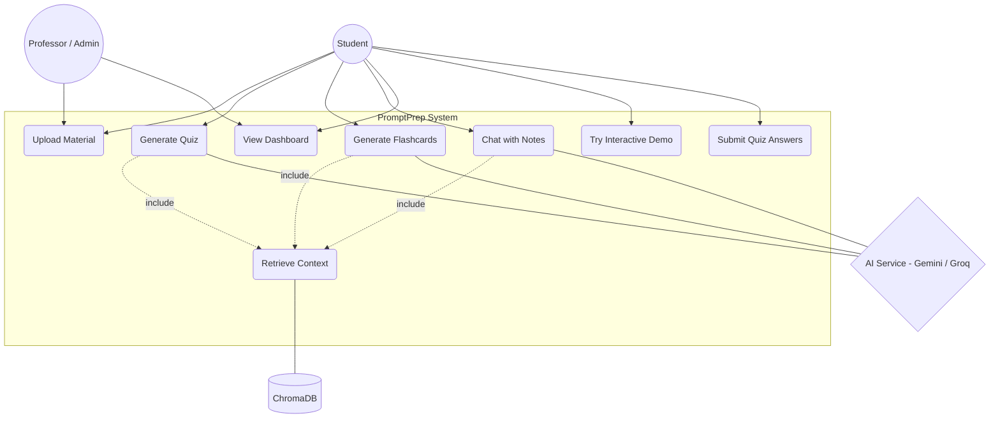

```mermaid
graph TD
    %% Define Actors
    Student((Student))
    Professor((Professor / Admin))
    AI{AI Service - Gemini / Groq}
    VectorDB[(ChromaDB)]

    %% System Boundary
    subgraph PromptPrep_System [PromptPrep System]
        UC1(Upload Material)
        UC2(Generate Quiz)
        UC3(Generate Flashcards)
        UC4(Chat with Notes)
        UC5(View Dashboard)
        UC6(Try Interactive Demo)
        UC7(Retrieve Context)
        UC8(Submit Quiz Answers)
    end

    %% Student Interactions
    Student --> UC1
    Student --> UC2
    Student --> UC3
    Student --> UC4
    Student --> UC5
    Student --> UC6
    Student --> UC8

    %% Professor Interactions
    Professor --> UC1
    Professor --> UC5

    %% System Dependencies (include relationships)
    UC2 -.->|include| UC7
    UC3 -.->|include| UC7
    UC4 -.->|include| UC7

    %% External Systems
    UC7 --- VectorDB
    UC2 --- AI
    UC3 --- AI
    UC4 --- AI
```
